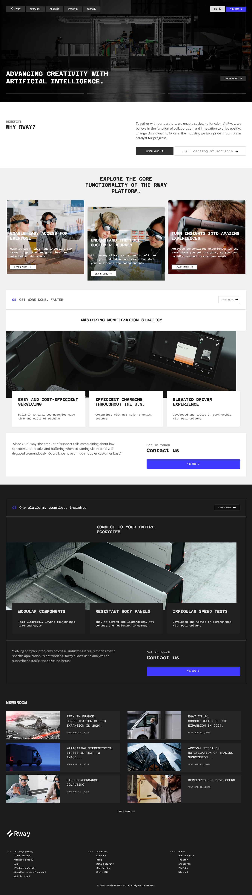

# Rway

## Table of contents

- [Overview](#overview)
  - [The challenge](#the-challenge)
  - [Screenshot](#screenshot)
  - [Links](#links)
- [My process](#my-process)
  - [Built with](#built-with)
- [Author](#author)

## Overview

Rway company web application.

### Screenshot

### Links

- Live Site URL: [Rway](https://rway.netlify.app/)

## My process

### Built with

- Semantic HTML5 markup
- CSS custom properties
- Flexbox
- CSS Grid
- Fluid Type
- Fluid Space

## Author

- Frontend Mentor - [@Flashdaniel](https://www.frontendmentor.io/profile/Flashdaniel)
- Linkedin - [@Daniel Nweze](https://www.linkedin.com/in/daniel-nweze-017909214/)
